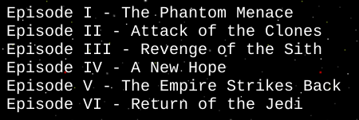
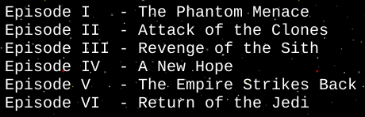

# Guerras Estelares 🌠

Um página com as intros do melhores filmes _ever_.


## Atividade

Você deve usar a Star Wars API (https://swapi.dev) para poder (a) carregar
dinamicamente a lista de filmes e (b) também para exibir o respectivo texto
introdutório quando o usuário selecionar um filme.


### Exercício 0: "cubar" a API

Dê uma explorada na Star Wars API. Será necessário fazer
apenas 1 chamada para pegar todos os filmes.

Além disso, **inclua o arquivo** `starwars.js` em `index.html` **como um módulo**.
Veja [como incluir um módulo JS][slides-modulos]). Ele será
o único arquivo incluído no `index.html`, porque os outros serão `import` ados
dentro dele.

Obs: o arquivo `starwars.js` ainda não foi incluído. A melhor forma
para incluí-lo é no HEAD da página usando o atributo `defer`
(para que comece a ser baixado o quanto antes, mas só seja executado
depois do navegador terminar o _parsing_ da página).


### Exercício 1: player de música

Vamos colocar certa música pra tocar (e você sabe qual). Via JavaScript, pôr uma
música pra tocar é tão simples quanto:

```js
const musica = new Audio(url)
musica.play()
```

Você pode fazer isso, ou então usar um _music player_ prontinho, com interface
gráfica pronta (dê uma lidinha no arquivo `music.js`).

Ele exporta uma função `play(...)` que espera receber 2 parâmetros:

1. Objeto com informações da música:
   - URL do áudio: `audio/tema-sw.mp3`
   - URL da capa: `imgs/logo.svg`
   - Título: Intro
   - Artista: John Williams
1. Elemento HTML onde o _player_ será injetado (no caso, `document.body`)

Ou seja, (a) importe essa função `play` do `music.js` no seu 
arquivo `starwars.js` e (b) invoque-a passando 2 argumentos referentes
aos parâmetros especificados. Para saber os nomes das propriedades
do 1º parâmetro, veja a assinatura da função `play` em `music.js`.


### Exercício 2: preencher lista de filmes

Faça uma requisição Ajax ([ajax nos slides][slides-ajax]) para pegar a lista
de filmes e, quando a tiver, preencha a `#filmes ul` com um `li` para cada
filme ([slides sobre como inserir elementos dinamicamente][slides-dinamicos]).

Cada `li` deve ter o texto "Episode ROMANO - TITULO", em que ROMANO é
o algarismo romano referente ao número do filme e TITULO é o título.

Para a chamada Ajax, você deve usar o `fetch`, que retorna uma promessa
([`fetch` nos slides][slides-fetch]) e pode trabalhar tanto com a
promessa diretamente ou por meio de async/await 
([slides sobre async-await][slides-async-wait]).

A resposta da chamada Ajax com dados sobre os filmes não traz o número
do filme em romano. Então, será necessário converter de algarismo
decimal para romano. Isso deve ser feito em um módulo `roman.js`
que `export` essa funcionalidade e seja `import` em `starwars.js`.

<details>
   <summary>Convertendo de romano para decimal...</summary>

   Uma ideia legal aqui é aproveitar o fato de que (a) são poucos filmes,
   (b) que objetos em JavaScript são dicionários e que (c) é possível
   acessar suas propriedades se soubermos seu nome em uma string
   ao usar a notação colchetes (ie, `obj[prop]`).

   Por exemplo, veja como poderíamos fazer pra converter emojis de
   frutas para nomes de frutas:

   ```js
   function emojiParaNome(emoji) {
      const dados = {
         '🍎': 'Maçã',
         '🍍': 'Abacaxi',
         '🥝': 'Kiwi',
         '🍓': 'Morango'
      }

      // retorna o valor da propriedade cujo
      // nome é o emoji do parâmetro
      return dados[emoji]
   }

   //...
   console.log(`Gosto de ${emojiParaNome(🍎)}`)
   ```
</details>

Se desejar deixar o título de cada filme alinhado (como na segunda imagem),
você pode preencher a string referente ao número romano para que ela tenha
no mínimo um comprimento definido.




<details>
   <summary>Como preencher uma string com espaços...</summary>

   Strings possuem dois métodos interessante: 
   `s.padStart(tamanho, caractere)` e `s.padEnd(tamanho, caractere)`.
   Esses métodos repetem o `caractere` uma quantidade de vezes 
   suficiente para que `s` tenha pelo menos o `tamanho`. Caso 
   `s.length >= tamanho`, nada acontece. Caso contrário,
   é retornada uma string preenchida com `tamanho - s.length`
   `caracter` no início ou no fim de `s`.

   Exemplo:
   ```js
   let alunos = ['Lestat', 'Rui', 'Adamastor']
   alunos = alunos.map(aluno => aluno.padEnd(10, '-'))
   // [
   //   'Lestat----',
   //   'Rui-------',
   //   'Adamastor-'
   // ]
   ```
</details>


### Exercício 3: mostrar a "intro" ao clicar

Ao clicar em um dos episódios, você deve carregar a introdução do filme
em `pre.introducao`. O texto a ser colocado nesse elemento deve ser composto
por:

```
Episode ROMANO
TITULO

CONTEÚDO
```

...seguindo essas quebras de linha (e linha em branco). Além de definir
o conteúdo de `pre.introducao` conforme definido, para reiniciar a animação
(texto comece a subir novamente), invoque a função de `restart-animation.js`.


<details>
   <summary>Como colocar evento de <code>'click'</code> ao <code>&lt;li&gt;</code> recém-criado?</summary>

   Para tratar um evento (eg, `click`) de um elemento que estamos
   criando dinamicamente, há diferentes opções:

   1. **_Event delegation_** (não vimos em aula): em vez de registrar
      o `click` em cada `<li>`, registramos no pai dele. Dentro
      da função _handler_ do evento, perguntamos quem é o `evt.target`
      (não confunda com `evt.currentTarget`¹). Verifica-se
      se o `target` é um dos `<li>` da `<ul>` e, em caso afirmativo,
      descobre-se de qual filme aquele `<li>` se refere. Isso pode ser feito,
      por exemplo, por meio de atributos de dados colocados no `<li>`
      (ie, `<li data-episode-id="...">`).
   1. Inserir novo elemento usando **`document.createElement('li')`**:
      quando usamos a "forma mais burocrática" para criar novos elementos,
      podemos configurá-lo antes de inserí-lo na árvore. Ou seja,
      podemos chamar `addEventListener(...)` no próprio `<li>`.
   1. Inserir novo elemento criando um **fragmento de DOM**: nessa abordagem,
      temos um _template_ (código HTML dentro de uma string do JavaScript) mas,
      em vez de fazer `pai.innerHTML += template`, criamos um fragmento de DOM,
      configuramos ele e, então, inserimos no DOM real.
      Dessa forma podemos chamar `addEventListener(...)` em qualquer elemento
      do _template_ antes que ele seja inserido do DOM oficial.


   ¹`evt.target` vs `evt.currentTarget`: apesar de parecidos, essas propriedades podem ter valores diferentes. Enquanto `currentTarget` sempre aponta exatamente para o elemento em que registramos o evento (nesse caso, chamamos `addEventListener` na `#filmes ul`), o `target` pode ser um dos filhos/descendentes de quem sofreu o evento (ou seja, pode ser uma das `<li>`).
</details>


### Opcional 4: filmes em ordem numérica

Antes de inserir os elementos referentes a cada filme (as `li`s),
ordene os filmes de acordo com seu número, de forma que o primeiro
seja o filme I.

Em JavaScript, vetores possuem o método `v.sort(funcaoComparadora)`.
Veja [a documentação de `v.sort()`][array-sort] na MDN.


### Opcional 5: `fetch` com cache no `localStorage`

Para exercitar a criação de promessas e também Web Storage, você deve
criar uma função para substituir o `fetch` e vamos chamá-lo de `friendlyFetch`.
Ele é amigável porque sempre que faz uma requisição Ajax, salva o resultado
(depois do `.json()`) em _cache_ no `localStorage` usando a URL requisitada
como chave. E antes de delegar para a chamada do `fetch` original, verifica
se já não possui a resposta no _cache_, evitando sobrecarregar a API de
Star Wars. Crie essa função em um módulo `friendly-fetch.js`.

Lembre-se que o Web Storage salva apenas strings, então você pode precisar
serializar um objeto antes de salvar e também dessearializar depois 
que recuperar o valor salvo lá. Veja [slides sobre JSON][slides-json].

É possível criar uma promessa diretamente ou como valor de retorno de uma
função `async`.

<details>
   <summary>Criando uma promessa...</summary>

   ```js
   function friendlyFetch(url) {
      const promessaDeRequisicao = new Promise((resolve, reject) => {
         // ...
         // executa algo assíncrono (eg, chama fetch(url))
         // ...
         // eventualmente chama resolve(resultado)
         // e se der erro, chama reject(erro)
      })

      return promessaDeRequisicao
   }
   ```
</details>

<details>
   <summary>Retorno de função async...</summary>

   ```js
   async function friendlyFetch(url) {
      // ...
      // executa algo assíncrono (eg, chama fetch(url))
      // possivelmente aguardando o resultado do await
      // ...
      // retorna o resultado
   }
   ```
</details>

Para lembrar como usar `localStorage`, veja os 
[slides sobre Web Storage][slides-webstorage].


## FAQ

1. Como enviar requisições assíncronas (Ajax)?
    1. Usar [XMLHttpRequest][slides-ajax] diretamente
    1. Usar [fetch][slides-fetch]
1. Como usar o `localStorage`?
   - Veja nos [slides sobre Web Storage][slides-webstorage]


[slides-webstorage]: https://fegemo.github.io/cefet-web/classes/js8/#web-storage
[slides-ajax]: https://fegemo.github.io/cefet-web/classes/js8/#ajax
[slides-fetch]: https://fegemo.github.io/cefet-web/classes/js8/#fetch
[slides-async-wait]: https://fegemo.github.io/cefet-web/classes/js7/#async-await
[slides-dinamicos]: https://fegemo.github.io/cefet-web/classes/js6/#criando-elementos-html-dinamicamente
[slides-modulos]: https://fegemo.github.io/cefet-web/classes/js7/#modulos
[slides-json]: https://fegemo.github.io/cefet-web/classes/js8/#json
[array-sort]: https://developer.mozilla.org/pt-BR/docs/Web/JavaScript/Reference/Global_Objects/Array/sort